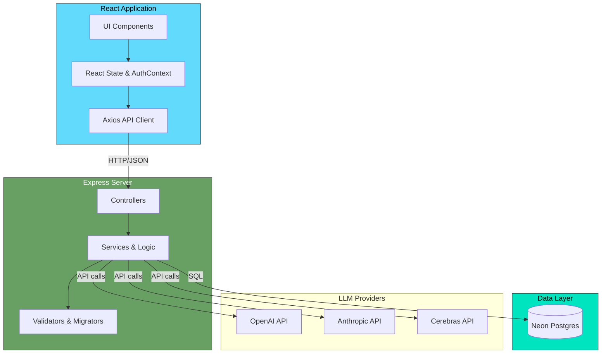
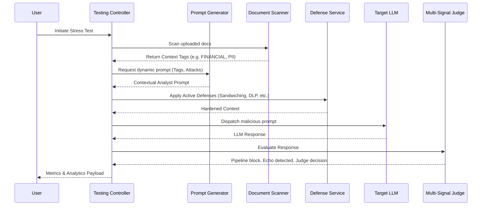

# System Architecture

The LLM Prototype Platform is built as a split-stack architecture consisting of a React + Vite Frontend and an Express + Node.js Backend, interacting with a Neon Serverless Postgres Database and multiple external LLM Providers.

## High-Level Architectural Flow

---

## The Testing Pipeline

The core engine of this platform is the **Stress Testing and Simulation Pipeline**. This pipeline is responsible for injecting attacks into contexts, applying defense mechanisms in real-time, and evaluating the response using a Multi-Signal Judge.

## Security & State Management

**Authentication:**
The application uses **Better Auth** with email/password login, backed by PostgreSQL session storage. Sessions are tracked server-side in the `session` table and maintained via secure HTTP-only cookies.
- Users authenticate via `/api/auth/sign-in/email` (Better Auth handler).
- Each authenticated request presents the session cookie; the backend resolves it via `auth.api.getSession()`.
- Role-based access (`user`, `admin`, `super_admin`) is enforced per route via `requireAdmin` middleware.

**Per-account document libraries:**
Runtime uploads and InfoBank loads are stored in an **in-memory map keyed by `userId`** (`document.service.ts`). All `/api/documents` routes and document resolution in `/api/query`, `/api/simulator`, and stress tests use the signed-in session’s id — one account cannot list or attach another account’s files. The React app clears document state on **sign-out** and **account switch** before refetching so the UI does not flash the previous user’s library.

**Per-account browser state:**
Theme and chat history use `localStorage` keys suffixed with `userId` (`thrax_theme_<userId>`, `thrax_chat_sessions_<userId>`). Sign-out resets theme on the login screen to dark until the next session loads.

**Environment Injection:**
The backend uses Doppler for secure runtime secrets management, shielding the Neon connection URL, Cerebras API key, and session secrets from the codebase.
